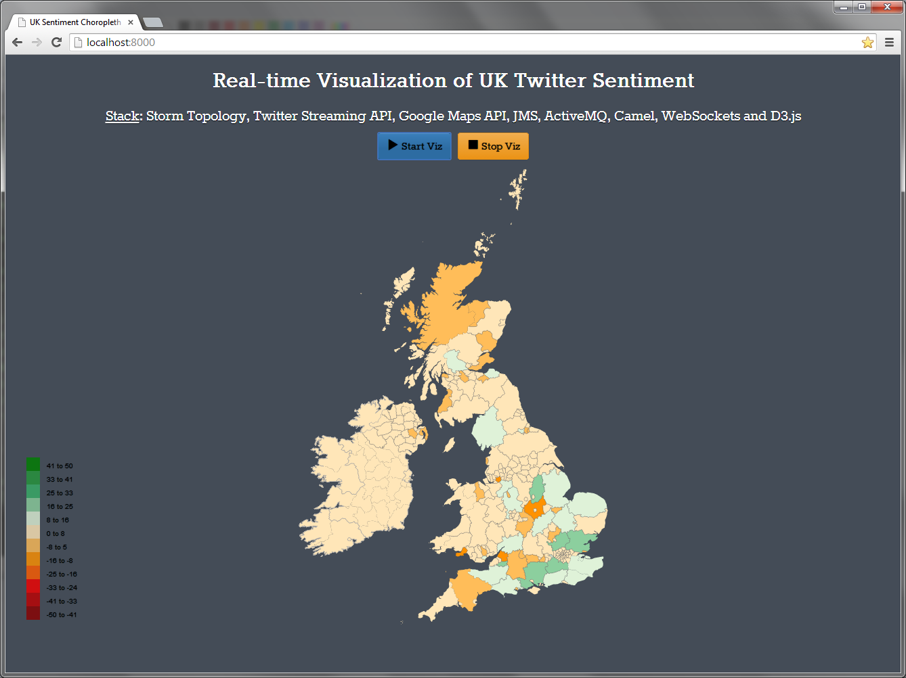

# StormTweetsSentimentD3UKViz
----------

### You might also be interested in checking out my other project, Twitter sentiment of States of US on a D3.js Choropleth Map on [StormTweetsSentimentD3Viz](https://github.com/P7h/StormTweetsSentimentD3Viz).

## Introduction
This repository contains an application which is built to demonstrate as an example of Storm distributed framework by performing sentiment analysis of tweets originating from U.K. in real-time. This Topology retrieves tweets originating from UK and computes and visualizes the sentiment scores of each of the county / region of United States [based on tweets] in a Choropleth Map using [D3.js](http://d3js.org) continuously for 10 minutes [in local mode]. User can also explicitly kill the topology by pressing `Ctrl+C` for exiting the application.

[Storm](http://storm-project.net) is a free and open source distributed real-time computation system, developed at BackType by Nathan Marz and team. It has been open sourced by Twitter [post BackType acquisition] in August, 2011. 
This application has been developed and tested with Storm v0.8.2 and above [on Windows 7 in local mode]. Application works fine with Storm versions > v0.8.2. 

This application has been tested in: 

+ Local mode on a CentOS virtual machine and even on Microsoft Windows 7 machine.
+ Cluster mode on a private cluster and also on Amazon EC2 environment of 4 machines and 5 machines respectively; with all the machines in private cluster running Ubuntu while EC2 environment machines were powered by CentOS.

## Features
* Application retrieves tweets using Twitter Streaming API (using [Twitter4J](http://twitter4j.org)). 
* It analyses sentiments of all the tweets originating from UK.
* There are three different objects within a tweet that we can use to determine it’s origin. This application tries to find the location using all the three options and prioritizes location received in the following order [high to low]:
	* The coordinates object. -- I solely rely on the coordinates object of a tweet in this project.
	* The place object. -- Not considered in this project.
	* The user object. -- Not considered in this project.
* For reverse geocoding, this application uses Google Maps API. 
	* For more information and sign up, please check [Google Maps API page](https://google-developers.appspot.com/maps/documentation/geocoding/#ReverseGeocoding).
	* Please note that you would need Google account for signing up for [Google Maps API key](https://google-developers.appspot.com/maps/documentation/geocoding/#api_key).
	* Also, for [previous reverse geocoding requirements](https://github.com/P7h/StormTweetsSentimentD3Viz), I chose Bing Maps and not Google Maps since Google Maps is too restrictive for our usage, as it has a limit of only 2500 requests per day and Bing allows 50k requests per day. But Bing's geocoding for UK is really not upto the mark. Google Maps API is far better and translates almost every latlong request to a place. So, I have gone with Google Maps API for this project due to the greater accuracy.
    * Just for the perspective, Bing Maps could convert only 3 out of 400 latlong requests to a location. While Google Maps API converted almost 95% of the latlong requests to a location.
* This application uses [AFINN](http://www2.imm.dtu.dk/pubdb/views/publication_details.php?id=6010) which contains a list of pre-computed sentiment scores.
	* These words are used to determine sentiment of the each tweet which is retrieved using Streaming API.
* By understanding sentiment values, we can get the most happiest county / region of UK and most unhappiest county / region as well.
* For visualization, I am using D3 to display the sentiment value of each county / region in real-time by conveying it in a color, appropriate to the sentiment value. Color of the county / region moves from Red to green, as the sentiment value decreases. 
* This codebase has been updated with decent comments, wherever required.
* Also this project has been made compatible with both Eclipse IDE and IntelliJ IDEA. Import the project in your favorite IDE [which has Maven plugin installed] and you can quickly follow the code.

Note: Huge thanks to my colleague [Ganesh Sastry](https://plus.google.com/u/0/+GaneshSastry) for his help on generating the TopoJSON of UK and the UK map right.

## Demo of UK Twitter Sentiment Visualization
### GIF of D3 Choropleth Visualization

### Screenshot of D3 Choropleth Visualization

## Configuration
* Please check the [`config.properties`](src/main/resources/config.properties#L3-6) and add your own values and complete the integration of Twitter API to your application by looking at your values from [Twitter Developer Page](https://dev.twitter.com/apps). 
	* If you did not create a Twitter App before, then please create a new Twitter App where you will get all the required values of `config.properties` afresh and then populate them here without any mistake. 
* Also please add the value of Google Maps API Key to [`config.properties`](src/main/resources/config.properties#L10), as that will be used for getting the reverse geocode location using Latitude and Longitude. 
	* If you do not have Google Maps API Key, please check [Getting Started with Google Maps](https://google-developers.appspot.com/maps/documentation/geocoding/#ReverseGeocoding) for signup and other information. 
* And finally please check [but _do not modify_] the [`AFINN-111.txt`](src/main/resources/AFINN-111.txt) file to see the pre-computed sentiment scores of ~2500 words / phrases.
	* For more info on AFINN, please check its [`AFINN-README.txt`](src/main/resources/AFINN-README.txt) and also check his [paper](http://www2.imm.dtu.dk/pubdb/views/publication_details.php?id=6010).

## Dependencies
* Storm v0.9.1-incubating [also works with Storm v0.8.2 and Storm v0.9.0.1]
* Jackson v1.9.12
* Spring v4.0.3
* Camel v2.13.0
* ActiveMQ Camel v5.9.0
* Twitter4J v4.0.1
* Google Guava v16.0.1
* SLF4J v1.7.6
* Logback v1.1.1

Also, please check [`pom.xml`](pom.xml) for more information on the various other dependencies of the project. 

## Requirements
This project uses Maven to build and run the topology. 
You need the following on your machine:

* Oracle JDK >= 1.7.x preferably JDK 8.0
* Apache Maven >= 3.2.1
* Python v2.7.x installed on the machine for triggering the visualization.
* Clone this repo and import as an existing Maven project to either Eclipse IDE or IntelliJ IDEA.
* This application uses [Google Guava](https://code.google.com/p/guava-libraries) for making life simple while using Collections and other generic stuff.
* This application also uses [Jackson](http://jackson.codehaus.org) for unmarshalling the JSON response got from Google Maps API.
* Requires ZooKeeper, JZMQ, ZeroMQ installed and configured in case of executing this project in distributed mode i.e. Storm Cluster. 
	- Follow the steps mentioned [here](https://github.com/nathanmarz/storm/wiki/Setting-up-a-Storm-cluster) for more details on setting up a Storm Cluster. 

Rest of the required frameworks and libraries are downloaded by Maven as required in the build process, the first time the Maven build is invoked.

## Usage
To build and run this topology, you must use Java 1.7 or above, preferably JDK 8.0.

### Local Mode:
* All the required frameworks and libraries are downloaded by Maven as required. 
* Local mode can also be run on Windows environment without installing any specific software or framework as such. *Note*: Please be sure to clear your temp folder as it adds lot of temporary files in every run. 
* In local mode, this application can be run from command line by invoking:

> mvn clean compile exec:java -Dexec.classpathScope=compile -Dexec.mainClass=org.p7h.storm.sentimentanalysis.topology.SentimentAnalysisTopology

or

> mvn clean compile package && java -jar target/storm-sentiment-uk-viz-0.1-jar-with-dependencies.jar

* Start Python SimpleHTTPServer in the [`web`](web) folder of this code repo. 
> python -m SimpleHTTPServer

* For D3 Choropleth Map visualization, launch a browser [preferably Google Chrome] and point to [`index.html`](http://localhost:8000) hosted on the above Python server. 
	* Click on "Start Viz" button to trigger the D3 Choropleth Map visualization. 
	* You can stop the visualization anytime by clicking on "Stop Viz" button. 
	* This Map updates as and when a tweet is analyzed by Storm and displays in real-time, visualization of the sentiment value of each of the county / region of United States of America. 

### Distributed [or Cluster / Production] Mode:
Distributed mode requires a complete and proper Storm Cluster setup. Please refer this [wiki](https://github.com/nathanmarz/storm/wiki/Setting-up-a-Storm-cluster) for setting up a Storm Cluster. 
In distributed mode, after starting Nimbus and Supervisors on individual machines, this application can be executed on the master [or Nimbus] machine by invoking the following on the command line:

> storm jar target/storm-sentiment-uk-viz-0.1.jar org.p7h.storm.sentimentanalysis.topology.SentimentAnalysisTopology SentimentAnalysis

## Problems
If you find any issues, please report them either raising an [issue](https://github.com/P7h/StormTweetsSentimentD3UKViz/issues) here on GitHub or alert me on my Twitter handle [@P7h](http://twitter.com/P7h). Or even better, please send a [pull request](https://github.com/P7h/StormTweetsSentimentD3UKViz/pulls).
Appreciate your help. Thanks!

## License
Copyright &copy; 2013-14 Prashanth Babu. 
Licensed under the [Apache License, Version 2.0](http://www.apache.org/licenses/LICENSE-2.0).
